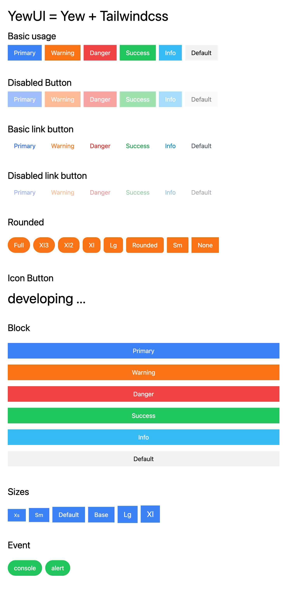

# yew-ui

A collection of UI components for yew.

## list of tools used
- [rust](https://www.rust-lang.org) 
- [yew](https://yew.rs/)
- [gloo](https://docs.rs/gloo/latest/gloo/)
- [rust-analyzer](https://marketplace.visualstudio.com/items?itemName=rust-lang.rust-analyzer).
- [trunk](https://trunkrs.dev/)
- [tailwindcss](https://tailwindcss.com/)

## Button


## components
- install trunk
```
cargo install trunk --locked
```
- install wasm32-unknown-unknown
```
rustup target add wasm32-unknown-unknown
```

## License

This project is licensed under the MIT License. See the [LICENSE](./LICENSE.txt) file for details.
